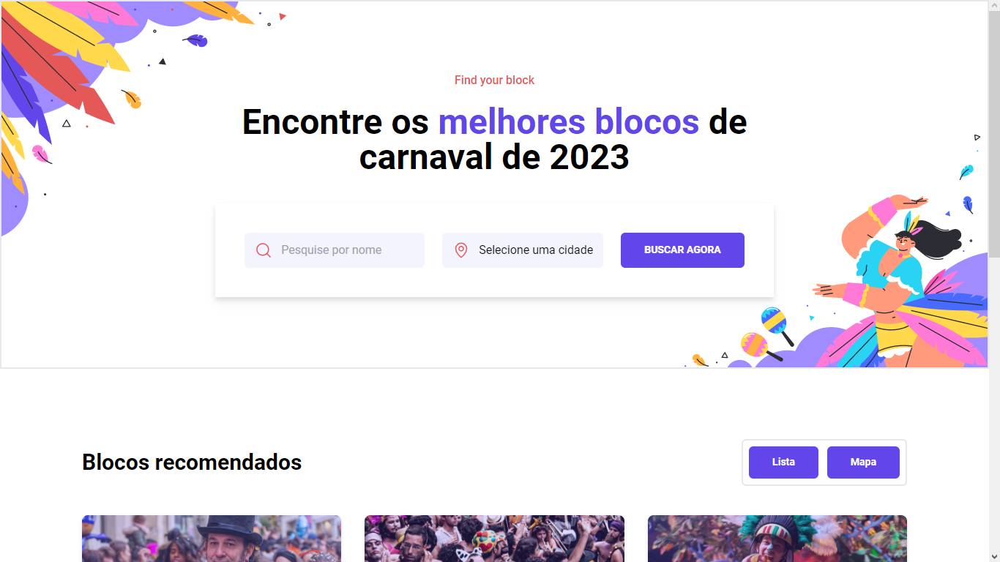

<h1 align="center"> Encontre os blocos do carnaval </h1>

Desafios exclusivos, promovido pela Rockeseat.  

  

 

  <h3 align='center'>Web</h3>
  

## ✅ Status

 - Em produção ✅

## 👨🏼‍💻 Funções

 - Responsividade 
 - Filtrar por nome 
 - Filtrar por cidade
 - API google maps
 - Mostrar localização no mapa para o estado selecionado
 - Variáveis de ambiente

## 🚀 Tecnologias

Esse projeto foi desenvolvido com as seguintes tecnologias:

- React
- Typescript
- Tailwindcss
- Phosphor React
- Lottie React
- Git e Github

## 💻 Projeto

Este projeto um dos desafios semanais da Rocketseat #boraCodar

- [Acesse o projeto finalizado, online](https://carnaval-bora-codar.vercel.app)

## 🔖 Layout

Você pode visualizar o layout do projeto através [DESSE LINK](https://www.figma.com/file/EIWH9XDAJO1RdcjoKSzDrm/%23boraCodar---Desafio-7-(Community)). É necessário ter conta no [Figma](https://figma.com) para acessá-lo.

## :memo: Licença

Esse projeto está sob a licença MIT.
